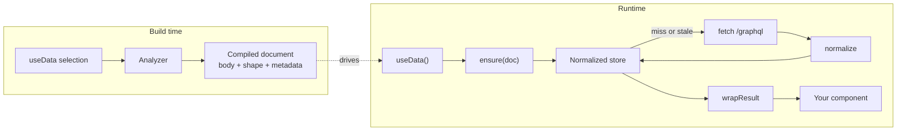
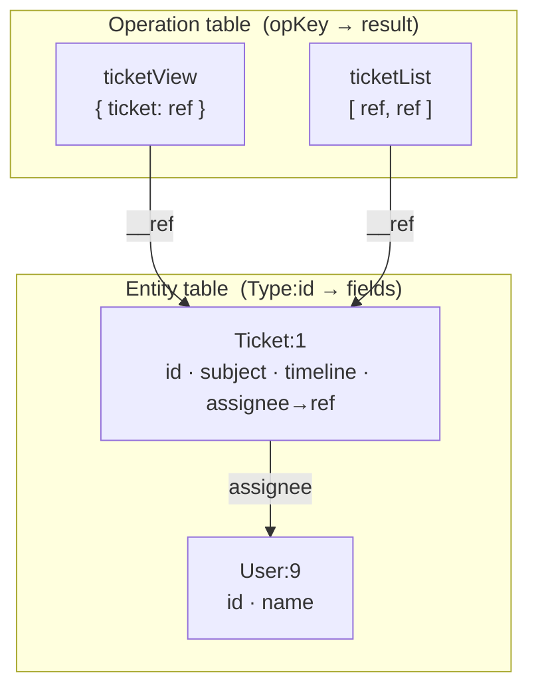
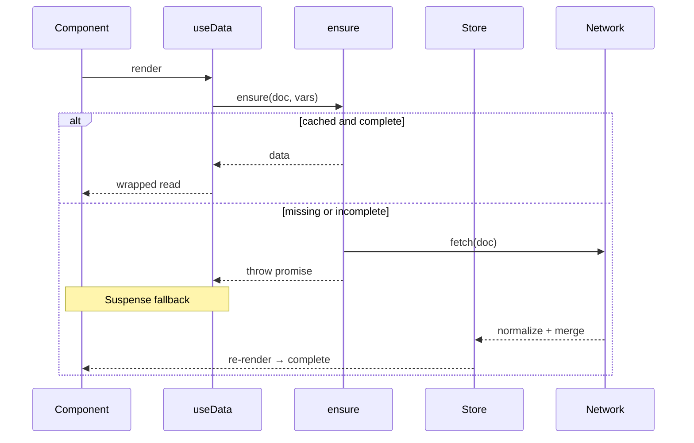
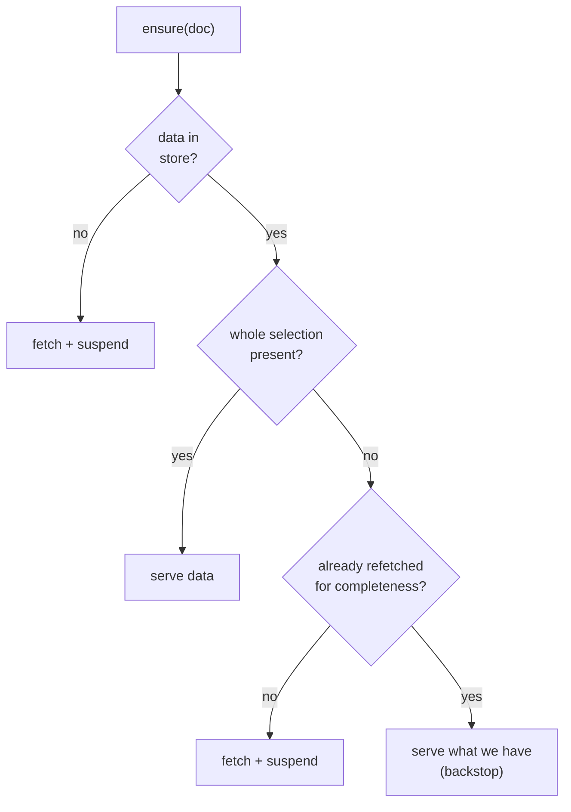

The `useData`, `usePaginatedData`, `useMutation`, and `op` hooks are a thin
surface over **pylon-query**, Pylon's owned typed client. You rarely touch it
directly — but knowing what happens between `useData()` and your rendered markup
explains why reads are consistent across the page, why a mutation updates every
component at once, and why a component **never renders half-loaded data**.

This page is the map of that machinery.

## The pipeline at a glance

Two phases. At build time the analyzer turns the fields your component reads into
a compiled GraphQL document. At runtime the client runs that document, stores the
result in a normalized cache, and hands your component a typed view of it.



Nothing in this pipeline is dynamic: the document is fixed at build time, so the
runtime never parses GraphQL or ships a query builder to the browser.

## From selection to document

The analyzer reads the fields your component accesses and compiles them into one
GraphQL operation. It emits the wire `body`, plus metadata the runtime needs:
pagination info for connections, argument aliases for a field read with different
arguments at multiple call sites, and a **selection shape** (used by the
completeness gate, below).

:::generates

```tsx title="You write"
const data = useData()
const ticket = data.ticket({id})
return <h1>{ticket.subject}</h1>
```

```graphql title="Pylon compiles"
query Ticket($v0: ID!) {
  ticket(id: $v0) { subject __typename id }
}
```

:::

The document is content-addressed — its id is a hash of the `body` — so the same
selection always maps to the same cache key, on the server during SSR and in the
browser alike.

## The normalized store

pylon-query keeps **two tables**, not one blob per query.

- The **operation table** maps `opKey(doc, variables)` to that operation's result
  — a tree of references, not raw objects.
- The **entity table** maps `"Type:id"` to an entity's fields.

Any object carrying both `__typename` and `id` is hoisted into the entity table
and replaced inline with a `{__ref}` pointer. The compiler auto-selects
`__typename` and `id` on every object that has them, so this happens without any
per-query configuration.



This is why cross-query consistency is automatic: two operations that read
`Ticket:1` point at the **same** entity record, so a mutation that patches it
re-renders both. Merges into the entity table are **non-destructive** — a narrow
query that selected only `{ id, subject }` can never erase the `timeline` a wider
query loaded.

:::note[Connections stay inline]
A Relay connection object (`{ nodes, edges, totalCount }`) has no `id`, so it
isn't hoisted — it lives inline on its owning entity (or op root), keyed per
pagination window. That keeps each page of an infinite list from overwriting the
others.
:::

## The read lifecycle

Reads are **render-pure** and **Suspense-driven**. A hook calls `ensure(doc)` at
first field access; if the data isn't cached it throws the in-flight promise, and
the nearest `<Suspense>` boundary shows its fallback until the fetch resolves.



Every mounted query subscribes to the store, so any write re-renders all of them.
Because `ensure` runs during render, it **never** starts a time-based refetch
there — otherwise one unrelated mutation would refetch every mounted query. That
job belongs to revalidation.

## Freshness: stale-while-revalidate

Cached data has a freshness window (`freshMs`, a few seconds by default). Within
it, a cached entry is served without a network round-trip. Past it, the entry is
**stale**: it's still served immediately, and a background refetch is kicked from
an **effect** (on mount or when the variables change) — never from render. So
navigating back to a page shows the last data instantly and quietly refreshes it,
without coupling refetches to unrelated re-renders.

## The completeness gate

Here is the guarantee that makes the client safe to read without defensive `?.`
everywhere: **a component only ever renders an operation whose entire selection is
present in the store.**

Why it's needed: entities are shared. A narrower operation can populate
`Ticket:1` *without* a field your operation selected — the field was never added
(merges are non-destructive, so it isn't a drop, it simply isn't there yet). If a
component read that shared entity anyway, the missing field would surface as
`undefined` and crash downstream (`x.totalCount`). That's a **partial read**.

The gate closes it. The compiled document carries a compact `shape` of its
selection; on every read, `ensure` checks the cached data against that shape:



The rule for "present" matches how loading actually works: a key that is present
but `null` counts as satisfied — a nullable field or a feature-gated field
legitimately resolves to `null`, and `null` is a real answer. Only a **missing**
key is a hole.

A complete-but-*stale* entry still serves immediately, so stale-while-revalidate
is unaffected — the gate never adds a suspense flash to an ordinary mutation.

### Worked example: a relation ref-swap

Say a mutation reassigns a ticket and selects only `assignee { id }`, pointing
`Ticket:1.assignee` at a fresh `User:12` that no query has fully loaded:

- The store now knows the assignee is `User:12` but doesn't have its `name`.
- You can't merge your way out — `User:9`'s name belongs to a different person,
  and `User:12` has no `name` yet. The gap is genuine missing data.
- On the next render `ensure` sees the selection is unsatisfied and suspends,
  fetches, and renders the correct value — instead of flashing a hole.

If `User:12` had already been loaded completely by another query, the merge keeps
its `name`, the operation stays satisfied, and the swap renders **instantly** with
no suspend. The gate reacts to the one condition that matters — "the entity this
operation now points at is missing a field I selected" — and nothing else.

### The one boundary

A backstop caps completeness-driven refetches at one per episode: if a refetch
still can't satisfy the operation, the client serves what it has rather than
suspend forever. In practice that only happens against a **spec-violating server**
that omits a selected field entirely (a compliant GraphQL server always returns
every selected field, `null` if the resolver returned null). That single case is
the only way a hole can reach a read — and it fails loudly, never silently.

## What you can rely on

- **Consistency** — every component reading an entity sees the same value; one
  mutation updates them all, no manual cache wiring.
- **Freshness** — recently-fetched data is served instantly; stale data refreshes
  in the background on navigation.
- **No partial reads** — a component never renders an operation that isn't fully
  loaded. Reads don't need defensive guards for transient cache states; when the
  data genuinely isn't there yet, you get Suspense, not a hole.

For the authoring surface built on top of this, see
[useData](/docs/frontend/use-data), [pagination](/docs/frontend/pagination), and
[mutations & op](/docs/frontend/data-client).
